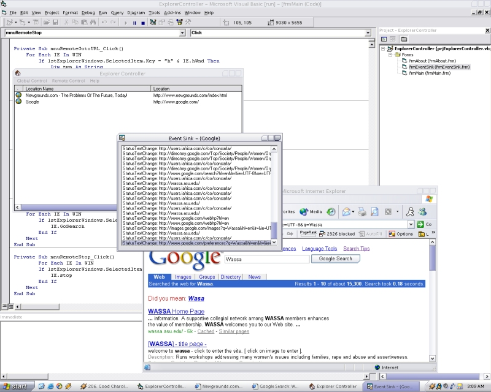



## Complete Explorer Controller

### Description

This will let you control any Internet/Explorer window with just a click of a button! Lets you control any browser window remotely, lets you control events to any browser window, full event sinking, and document control! Able to edit the html that is in the window! Good for making popup blocker, or something that needs a browser preview!
 
### More Info
 

             |
---                |---
**Submitted On**   |2003-12-23 14:16:06
**By**             |[Brandon Scott](https://github.com/Planet-Source-Code/PSCIndex/blob/master/ByAuthor/brandon-scott.md)
**Level**          |Advanced
**User Rating**    |5.0 (10 globes from 2 users)
**Compatibility**  |VB 6\.0
**Category**       |[Windows API Call/ Explanation](https://github.com/Planet-Source-Code/PSCIndex/blob/master/ByCategory/windows-api-call-explanation__1-39.md)
**World**          |[Visual Basic](https://github.com/Planet-Source-Code/PSCIndex/blob/master/ByWorld/visual-basic.md)
**Archive File**   |[Complete\_E1918487292005\.zip](https://github.com/Planet-Source-Code/brandon-scott-complete-explorer-controller__1-61948/archive/master.zip)

